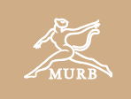

# 🏃 Murb - Performance Sportswear



**Premium Indian sportswear for athletes who demand more.**

Murb is a modern e-commerce platform for performance sportswear, designed specifically for the Indian market. Built with speed, style, and functionality in mind.

---

## ✨ Features

- 🛍️ **Shop** - Browse our curated collection of premium sportswear
- 🔍 **Search** - Find products quickly with intelligent search
- 🛒 **Cart** - Seamless shopping cart experience
- 💳 **Checkout** - Secure checkout with Indian payment support (₹)
- 📱 **Responsive** - Optimized for all devices
- ⚡ **Fast** - Lightning-fast performance with modern tech stack

---

## 🛠️ Tech Stack

| Technology | Purpose |
|------------|---------|
| **React** | UI Framework |
| **TypeScript** | Type Safety |
| **Vite** | Build Tool |
| **Tailwind CSS** | Styling |
| **shadcn/ui** | UI Components |

---

## 🚀 Getting Started

### Prerequisites

- Node.js (v18 or higher)
- npm or yarn

### Installation

```bash
# Clone the repository
git clone https://github.com/yourusername/murb-merch.git

# Navigate to project directory
cd murb-merch

# Install dependencies
npm install

# Start development server
npm run dev
```

The app will be available at `http://localhost:5173`

### Build for Production

```bash
npm run build
```

---

## 📁 Project Structure

```
murb-merch/
├── public/          # Static assets
├── src/
│   ├── components/  # Reusable UI components
│   ├── pages/       # Page components
│   ├── hooks/       # Custom React hooks
│   ├── lib/         # Utility functions
│   └── styles/      # Global styles
├── index.html
└── package.json
```

---

## 🤝 Contributing

Contributions are welcome! Please feel free to submit a Pull Request.

---

## 📄 License

This project is licensed under the MIT License.

---

<p align="center">
  Made with ❤️ in India
</p>
